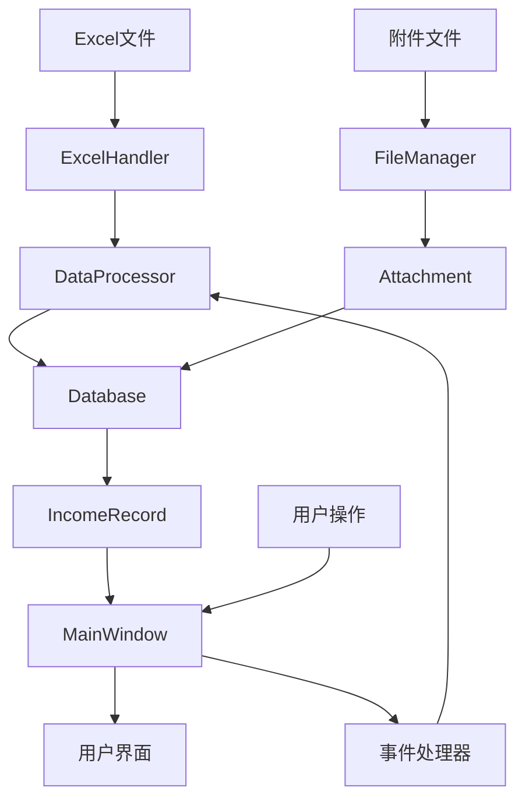

# 收入证据管理程序

<div align="center">


**收入证据管理系统** - 专业的财务数据管理与证据归档解决方案

[🎯 项目简介](#-项目简介) •
[✨ 功能特性](#-功能特性) •
[🚀 快速开始](#-快速开始) •
[📖 用户手册](#-用户手册) •
[🛠 开发文档](#-开发文档) •
[🔧 部署指南](#-部署指南) •
[❓ 常见问题](#-常见问题)

</div>

---

## 🎯 项目简介

开发这个程序是因为今年年审中针对按项目结算收入的行业（主要是软件行业），需要整理较多的收入结算证据，在证据管理上花费了较多时间。

因此开发了这个程序，方便管理程序收入证据。

声明：本程序使用Cursor进行开发

### 🏆 特征

- **🔒 数据安全**：100% 本地存储，符合数据保护法规，零数据泄露风险
- **📊 智能分析**：自动差异计算、趋势分析和数据可视化

## ✨ 功能特性

### 📊 专业数据管理

#### 🔄 智能数据导入

- **多格式支持**：`.xlsx`、`.xls`、`.csv` 格式无缝导入
- **数据预览**：导入前可预览数据结构和内容
- **增量导入**：支持增量数据更新，避免重复导入
- **错误检测**：实时数据验证和错误提示
- **大文件处理**：支持百万级数据量的高效处理

#### 🗃️ 项目管理

- **多租户架构**：完全隔离的多项目环境
- **项目模板**：预定义的行业标准模板

#### ✏️ 高级数据编辑

- **批量操作**：支持多行数据的批量编辑和更新
- **数据验证**：实时的数据完整性和业务规则检查
- **变更追踪**：详细记录每次数据修改的历史

### 🔍 专业数据筛选与搜索

#### 🎯 多维度筛选引擎

- **智能筛选器**：支持20+筛选维度，包括合同状态、金额范围、时间周期等
- **复合条件**：支持 AND/OR 逻辑的复杂筛选组合
- **保存筛选**：常用筛选条件可保存为模板，一键调用
- **快速筛选**：预设的常用筛选场景，如"有差异记录"、"缺失附件"等
- **动态筛选**：筛选结果实时更新，支持筛选条件的动态调整

#### 🔎 高级搜索功能

- **全文搜索**：支持对所有文本字段的全文检索
- **模糊匹配**：智能的近似匹配算法，容错搜索
- **搜索历史**：保存搜索历史，快速重复搜索
- **搜索建议**：基于历史数据的智能搜索建议

### 📁 附件管理

#### 📤 智能附件处理

- **拖拽上传**：现代化的拖拽界面，支持批量上传
- **格式支持**：支持30+文件格式，包括PDF、Office、图片、邮件等
- **自动分类**：根据文件类型自动分类和标记
- **文件预览**：内置预览功能，支持常见格式的快速预览
- **版本控制**：同一附件的多版本管理
- **压缩存储**：自动压缩存储，节省磁盘空间

#### 🗂️ 专业文档管理

- **自动归档**：按合同号自动创建和组织文件夹结构
- **文件索引**：全文索引支持，可搜索附件内容
- **访问控制**：文件级别的访问权限控制
- **批量操作**：支持附件的批量重命名、移动、删除
- **外部链接**：支持外部文件的链接管理

### 📈 专业财务分析

#### 🧮 智能差异分析

- **自动计算引擎**：实时计算账面收入与附件收入的差异
- **差异分类**：按差异类型、金额范围自动分类
- **趋势分析**：差异趋势图表和统计分析
- **异常检测**：基于统计学的异常数据自动识别
- **差异报告**：专业的差异分析报告生成

#### 📊 高级统计分析

- **实时仪表板**：关键指标的实时监控面板
- **多维度分析**：按客户、时间、产品线等维度的深度分析
- **数据透视**：灵活的数据透视表功能
- **可视化图表**：20+种专业财务图表类型
- **预测模型**：基于历史数据的收入预测

## 🚀 快速开始

### ⚙️ 环境准备

#### 1. Python 环境检查

```bash
# 检查Python版本
python --version
# 应显示: Python 3.7.x 或更高版本

# 检查pip版本
pip --version
# 建议升级到最新版本
python -m pip install --upgrade pip
```

#### 2. Git 工具 (可选)

如果使用Git克隆，请确保已安装 [Git for Windows](https://git-scm.com/download/win)

### 📦 安装步骤

#### 方式一：Git 克隆 (推荐)

```bash
# 1. 克隆仓库
git clone https://github.com/your-username/income-evidence-manager.git
cd income-evidence-manager

# 2. 创建虚拟环境 (强烈推荐)
python -m venv .venv
.venv\Scripts\activate

# 3. 安装依赖
pip install -r requirements.txt

# 4. 运行程序
python main.py
```

#### 方式二：直接下载

```bash
# 1. 下载ZIP文件并解压到目标目录
# 2. 打开PowerShell或命令提示符，进入解压目录
cd path\to\income-evidence-manager

# 3. 创建虚拟环境
python -m venv .venv
.venv\Scripts\activate

# 4. 安装依赖
pip install -r requirements.txt

# 5. 运行程序
python main.py
```

### 🎯 首次使用指南

#### 1. 启动应用程序

```bash
# 确保虚拟环境已激活
.venv\Scripts\activate

# 启动程序
python main.py
```

#### 2. 创建首个项目

1. **项目选择器**：程序启动后显示项目管理界面
2. **新建项目**：点击"创建新项目"按钮
3. **项目信息**：
   - 项目名称：例如"A公司2024年度年报审计"
   - 项目描述：详细描述项目用途 (可选)
   - 存储位置：选择项目数据存储位置

#### 3. 基础配置

1. **附件存储路径**：设置附件文件的存储根目录
2. **导入设置**：配置Excel导入的默认参数
3. **显示选项**：调整界面主题和显示偏好

#### 4. 导入首批数据

1. **准备Excel文件**：确保包含合同号、客户名、收入金额等必要列
2. **导入数据**：点击"导入Excel"，选择文件和工作表
3. **验证数据**：检查导入结果，确认数据正确性

### 🔧 环境验证

运行以下命令验证安装：

```bash
# 检查核心依赖
python -c "import customtkinter; print('CustomTkinter:', customtkinter.__version__)"
python -c "import pandas; print('Pandas:', pandas.__version__)"
python -c "import openpyxl; print('OpenPyXL:', openpyxl.__version__)"

# 运行系统检查 (可选)
python -c "from src.config import check_system; check_system()"
```

## 📖 用户手册

### 项目管理

#### 创建新项目

- 在项目启动器中点击"新建项目"
- 输入项目名称（必填）和描述（可选）
- 系统会自动创建项目目录和配置文件

#### 切换项目

- 在项目启动器中选择已有项目
- 双击项目名称或点击"打开项目"

### 数据导入

#### Excel文件导入

1. 准备Excel文件，确保包含以下必要列：

   - 合同号（必须唯一）
   - 客户名称
   - 本年确认的收入
2. 点击"导入Excel"按钮
3. 选择Excel文件和目标工作表
4. 确认列映射关系
5. 点击"导入"完成数据导入

#### 数据验证规则

- 合同号不能为空且必须唯一
- 客户名称不能为空
- 收入金额必须为有效数字
- 重复合同号会提示处理方式

### 数据操作

#### 添加记录

- 点击"添加记录"按钮
- 填写必要信息并保存
- 新增记录会自动标记

#### 编辑记录

- 双击表格行或点击"编辑"按钮
- 修改信息后保存
- 支持批量编辑操作

#### 删除记录

- 选择要删除的记录
- 点击"删除"按钮
- 确认删除操作

### 附件管理

#### 上传附件

1. 选择目标记录
2. 点击"管理附件"按钮
3. 使用以下方式上传：
   - 点击"添加附件"按钮选择文件
   - 直接拖拽文件到附件列表

#### 附件操作

- **查看附件**：双击附件名称
- **重命名**：右键选择重命名
- **删除附件**：选择附件后点击删除
- **打开文件夹**：快速访问附件存储位置

### 数据筛选

#### 基础筛选

- 使用顶部筛选器设置条件
- 支持合同号、客户名称模糊搜索
- 按差异状态、附件状态筛选

#### 高级筛选

- 组合多个筛选条件
- 自定义日期范围
- 保存和恢复筛选设置

### 数据分析

#### 差异分析

- 输入"附件确认的收入"
- 系统自动计算差异金额
- 添加差异原因备注

#### 统计信息

- 左侧面板显示实时统计
- 总记录数、差异统计
- 附件关联状态统计

### 数据导出

#### 导出Excel

1. 设置筛选条件（可选）
2. 点击"导出Excel"按钮
3. 选择导出路径和文件名
4. 确认导出设置

## 🛠 开发文档

### 🏗️ 系统架构

收入证据管理程序采用**分层架构设计**，确保代码的可维护性和可扩展性：

```
┌─────────────────────────────────────────────────────────────┐
│                    表示层 (Presentation Layer)                │
│  ┌─────────────────┐  ┌─────────────────┐  ┌─────────────────┐ │
│  │   主界面模块     │  │   对话框模块     │  │   组件模块       │ │
│  │  main_window.py │  │ record_dialog.py│  │ filter_widget.py│ │
│  └─────────────────┘  └─────────────────┘  └─────────────────┘ │
└─────────────────────────────────────────────────────────────┘
┌─────────────────────────────────────────────────────────────┐
│                    业务逻辑层 (Business Layer)                │
│  ┌─────────────────┐  ┌─────────────────┐  ┌─────────────────┐ │
│  │   数据处理器     │  │   项目管理器     │  │   文件管理器     │ │
│  │data_processor.py│  │project_manager  │  │ file_manager.py │ │
│  └─────────────────┘  └─────────────────┘  └─────────────────┘ │
└─────────────────────────────────────────────────────────────┘
┌─────────────────────────────────────────────────────────────┐
│                    数据访问层 (Data Access Layer)             │
│  ┌─────────────────┐  ┌─────────────────┐  ┌─────────────────┐ │
│  │   数据库模型     │  │   实体模型       │  │   Excel处理器    │ │
│  │   database.py   │  │income_record.py │  │ excel_handler.py│ │
│  └─────────────────┘  └─────────────────┘  └─────────────────┘ │
└─────────────────────────────────────────────────────────────┘
```

### 🔧 核心技术栈

#### 前端技术

| 技术                    | 版本    | 用途     | 优势                   |
| ----------------------- | ------- | -------- | ---------------------- |
| **CustomTkinter** | 5.2.0+  | GUI框架  | 现代化外观，响应式设计 |
| **Tkinter**       | 内置    | 基础GUI  | 跨平台兼容性好         |
| **Pillow**        | 10.0.0+ | 图像处理 | 丰富的图像格式支持     |

#### 数据处理

| 技术               | 版本   | 用途      | 优势                |
| ------------------ | ------ | --------- | ------------------- |
| **Pandas**   | 2.0.0+ | 数据分析  | 高性能数据处理      |
| **OpenPyXL** | 3.1.0+ | Excel操作 | 完整的Excel功能支持 |
| **xlrd**     | 2.0.1+ | Excel读取 | 兼容旧版Excel格式   |

#### 系统支持

| 技术              | 版本 | 用途       | 优势               |
| ----------------- | ---- | ---------- | ------------------ |
| **Python**  | 3.7+ | 运行环境   | 跨平台，丰富的生态 |
| **Pickle**  | 内置 | 数据序列化 | 高效的对象持久化   |
| **pathlib** | 内置 | 路径操作   | 现代化的路径处理   |

### 项目结构

```
收入证据管理程序/
├── main.py                 # 程序入口
├── requirements.txt        # 依赖列表
├── src/                   # 源代码
│   ├── config.py          # 配置文件
│   ├── gui/               # GUI界面模块
│   │   ├── main_window.py         # 主窗口
│   │   ├── project_launcher.py    # 项目启动器
│   │   ├── record_dialog.py       # 记录编辑对话框
│   │   ├── attachment_dialog.py   # 附件管理对话框
│   │   └── ...                    # 其他GUI组件
│   ├── data/              # 数据处理模块
│   │   ├── data_processor.py      # 数据处理器
│   │   ├── excel_handler.py       # Excel处理
│   │   ├── file_manager.py        # 文件管理
│   │   └── project_manager.py     # 项目管理
│   └── models/            # 数据模型
│       ├── database.py            # 数据库模型
│       ├── income_record.py       # 收入记录模型
│       └── attachment.py          # 附件模型
└── data/                  # 数据目录（被gitignore忽略）
    ├── app.log           # 应用日志
    ├── database.pkl      # 数据库文件
    └── attachments/      # 附件存储
```

### 技术栈

- **GUI框架**：[CustomTkinter](https://github.com/TomSchimansky/CustomTkinter) - 现代化的Tkinter界面库
- **数据处理**：[Pandas](https://pandas.pydata.org/) - 数据分析和处理
- **Excel操作**：[OpenPyXL](https://openpyxl.readthedocs.io/) - Excel文件读写
- **图像处理**：[Pillow](https://pillow.readthedocs.io/) - 图像处理库
- **数据持久化**：Python Pickle - 对象序列化

### 核心模块说明

#### 数据模型 (models/)

- `database.py`: 数据库操作和管理
- `income_record.py`: 收入记录数据结构
- `attachment.py`: 附件信息数据结构

#### 数据处理 (data/)

- `data_processor.py`: 核心数据处理逻辑
- `excel_handler.py`: Excel文件导入导出
- `file_manager.py`: 文件和附件管理
- `project_manager.py`: 项目管理功能

#### 用户界面 (gui/)

- `main_window.py`: 主界面和核心交互
- `project_launcher.py`: 项目选择和创建
- `record_dialog.py`: 记录编辑界面
- `attachment_dialog.py`: 附件管理界面

### 开发环境配置

1. **安装开发依赖**

   ```bash
   pip install -r requirements.txt
   pip install pytest  # 测试框架（可选）
   ```
2. **代码规范**

   - 遵循 PEP 8 Python编码规范
   - 使用类型注解提高代码可读性
   - 模块化设计，单一职责原则
3. **调试模式**

   - 修改 `src/config.py` 中的日志级别为 `DEBUG`
   - 查看 `data/app.log` 获取详细日志信息

### 扩展开发

#### 添加新功能

1. 在相应模块中添加功能函数
2. 更新数据模型（如需要）
3. 创建或修改GUI界面
4. 更新配置文件
5. 添加相应的错误处理

#### 自定义配置

- 修改 `src/config.py` 中的配置项
- 重启程序使配置生效

### 🎨 UI组件架构

```python
# GUI组件层次结构
MainWindow (CTk)
├── HeaderFrame (CTkFrame)
│   ├── ToolbarFrame (CTkFrame)
│   │   ├── ImportButton (CTkButton)
│   │   ├── ExportButton (CTkButton)
│   │   └── SettingsButton (CTkButton)
│   └── FilterFrame (CTkFrame)
│       ├── SearchEntry (CTkEntry)
│       └── FilterComboBox (CTkComboBox)
├── ContentFrame (CTkFrame)
│   ├── SidebarFrame (CTkFrame)
│   │   ├── StatisticsPanel (CTkFrame)
│   │   └── FilterPanel (CTkFrame)
│   └── MainPanel (CTkFrame)
│       ├── DataTable (CTkScrollableFrame)
│       └── PaginationFrame (CTkFrame)
└── StatusFrame (CTkFrame)
    ├── StatusLabel (CTkLabel)
    └── ProgressBar (CTkProgressBar)
```

### 📊 数据流架构



## 🔧 部署指南

### 📦 打包发布

#### 使用 PyInstaller 创建可执行文件

1. **安装打包工具**

   ```bash
   pip install pyinstaller
   ```
2. **创建spec文件** (`income_manager.spec`)

   ```python
   # -*- mode: python ; coding: utf-8 -*-

   block_cipher = None

   a = Analysis(
       ['main.py'],
       pathex=[],
       binaries=[],
       datas=[
           ('src/assets/*', 'assets/'),
           ('src/config.py', 'src/'),
       ],
       hiddenimports=[
           'customtkinter',
           'pandas',
           'openpyxl',
           'PIL'
       ],
       hookspath=[],
       hooksconfig={},
       runtime_hooks=[],
       excludes=[],
       win_no_prefer_redirects=False,
       win_private_assemblies=False,
       cipher=block_cipher,
       noarchive=False,
   )

   pyd = PYZ(a.pure, a.zipped_data, cipher=block_cipher)

   exe = EXE(
       pyd,
       a.scripts,
       [],
       exclude_binaries=True,
       name='收入证据管理程序',
       debug=False,
       bootloader_ignore_signals=False,
       strip=False,
       upx=True,
       console=False,
       disable_windowed_traceback=False,
       argv_emulation=False,
       target_arch=None,
       codesign_identity=None,
       entitlements_file=None,
   )

   coll = COLLECT(
       exe,
       a.binaries,
       a.zipfiles,
       a.datas,
       strip=False,
       upx=True,
       upx_exclude=[],
       name='income_manager'
   )
   ```
3. **执行打包命令**

   ```bash
   pyinstaller income_manager.spec
   ```

## ❓ 常见问题

### 🔧 安装与环境问题

#### Q: 安装依赖时出现错误怎么办？

**症状**：`pip install` 命令执行失败或依赖包安装不完整

**解决方案**：

```bash
# 1. 升级pip到最新版本
python -m pip install --upgrade pip

# 2. 使用国内镜像源（推荐）
pip install -r requirements.txt -i https://pypi.tuna.tsinghua.edu.cn/simple

# 3. 如果仍有问题，尝试逐个安装
pip install customtkinter>=5.2.0
pip install pandas>=2.0.0
pip install openpyxl>=3.1.0

# 4. 检查Python版本兼容性
python --version  # 应为3.7+
```

#### Q: 程序无法启动，显示ModuleNotFoundError？

**症状**：出现类似 `ModuleNotFoundError: No module named 'customtkinter'` 的错误

**排查步骤**：

1. **检查虚拟环境**：

   ```bash
   # 确保虚拟环境已激活
   .venv\Scripts\activate
   ```
2. **验证依赖安装**：

   ```bash
   # 检查已安装的包
   pip list

   # 重新安装依赖
   pip install -r requirements.txt --force-reinstall
   ```
3. **检查Python路径**：

   ```bash
   python -c "import sys; print(sys.path)"
   ```

#### Q: Windows系统上出现编码错误？

**症状**：显示中文字符乱码或编码相关错误

**解决方案**：

```bash
# 设置系统环境变量
set PYTHONIOENCODING=utf-8

# 或在PowerShell中
$env:PYTHONIOENCODING="utf-8"
python main.py
```

### 📊 数据导入问题

#### Q: Excel导入失败，提示文件格式错误？

**常见原因与解决方案**：

| 问题       | 原因                      | 解决方案                |
| ---------- | ------------------------- | ----------------------- |
| 文件被占用 | Excel文件在其他程序中打开 | 关闭所有Excel程序后重试 |
| 格式不支持 | 文件为.csv或其他格式      | 转换为.xlsx或.xls格式   |
| 文件损坏   | Excel文件结构损坏         | 尝试修复文件或重新创建  |
| 权限不足   | 文件为只读或权限受限      | 检查文件权限设置        |

#### Q: 导入的数据显示不完整或错误？

**排查清单**：

- [ ] 检查Excel文件中的必要列是否存在
- [ ] 确认数据格式符合要求（数字列不含文本）
- [ ] 验证合同号的唯一性
- [ ] 检查是否选择了正确的工作表

**数据验证脚本**：

```python
import pandas as pd

# 验证Excel文件结构
def validate_excel(file_path):
    try:
        df = pd.read_excel(file_path)
        required_columns = ['合同号', '客户名', '本年确认的收入']
  
        missing_columns = [col for col in required_columns if col not in df.columns]
        if missing_columns:
            print(f"缺少必要列: {missing_columns}")
  
        # 检查重复合同号
        duplicates = df[df['合同号'].duplicated()]
        if not duplicates.empty:
            print(f"发现重复合同号: {duplicates['合同号'].tolist()}")
  
    except Exception as e:
        print(f"文件验证失败: {e}")
```

### 📁 附件管理问题

#### Q: 附件上传失败或附件丢失？

**问题诊断**：

```bash
# 检查附件目录权限
dir data\attachments /Q

# 检查磁盘空间
fsutil volume diskfree C:

# 验证文件路径
python -c "from pathlib import Path; print(Path('data/attachments').absolute())"
```

**解决方案**：

1. **权限问题**：以管理员身份运行程序
2. **空间不足**：清理磁盘空间或更改存储位置
3. **路径问题**：避免使用包含特殊字符的路径

#### Q: 附件文件夹无法打开？

**可能原因**：

- 文件夹路径包含特殊字符
- 系统文件关联设置问题
- 安全软件阻止

**解决方案**：

```python
# 手动打开附件文件夹
import os
import subprocess

def open_folder(path):
    try:
        subprocess.run(['explorer', path], check=True)
    except Exception as e:
        print(f"无法打开文件夹: {e}")
        # 备选方案
        os.startfile(path)
```

### 🚀 性能优化问题

#### Q: 程序运行缓慢，界面卡顿？

**性能分析工具**：

```bash
# 安装性能分析工具
pip install memory-profiler psutil

# 运行性能分析
python -m memory_profiler main.py
```

**优化建议**：

1. **数据量优化**：

   - 使用筛选功能减少显示数据
   - 启用分页显示（每页1000条记录）
   - 定期清理历史数据
2. **系统资源优化**：

   ```bash
   # 检查系统资源使用
   tasklist /fi "imagename eq python.exe"

   # 优化虚拟内存设置
   # 控制面板 > 系统 > 高级系统设置 > 性能设置
   ```
3. **程序配置优化**：

   ```python
   # 在 config.py 中调整性能参数
   PERFORMANCE_CONFIG = {
       "max_display_rows": 1000,
       "auto_save_interval": 300,  # 5分钟
       "enable_lazy_loading": True,
       "cache_size_mb": 128
   }
   ```

### 🔍 日志分析与故障排除

#### 查看系统日志

```bash
# 查看应用日志
type data\app.log | more

# 查看最近的错误
findstr /i "error" data\app.log

# 实时监控日志
Get-Content data\app.log -Wait -Tail 10
```

#### 常见错误代码

| 错误代码 | 含义              | 解决方案           |
| -------- | ----------------- | ------------------ |
| E001     | 数据库文件损坏    | 从备份恢复数据     |
| E002     | Excel文件格式错误 | 检查文件格式和结构 |
| E003     | 权限不足          | 以管理员身份运行   |
| E004     | 磁盘空间不足      | 清理磁盘空间       |
| E005     | 网络连接问题      | 检查网络设置       |

## 📄 许可证与版权

### 开源许可证

本项目采用 **MIT 许可证**，允许自由使用、修改和分发。

```
MIT License

Copyright (c) 2024 收入证据管理程序开发团队

Permission is hereby granted, free of charge, to any person obtaining a copy
of this software and associated documentation files (the "Software"), to deal
in the Software without restriction, including without limitation the rights
to use, copy, modify, merge, publish, distribute, sublicense, and/or sell
copies of the Software, and to permit persons to whom the Software is
furnished to do so, subject to the following conditions:

The above copyright notice and this permission notice shall be included in all
copies or substantial portions of the Software.
```

详情请参阅 [LICENSE](LICENSE) 文件。

### 第三方组件许可

| 组件          | 许可证       | 链接                                                  |
| ------------- | ------------ | ----------------------------------------------------- |
| CustomTkinter | MIT          | [GitHub](https://github.com/TomSchimansky/CustomTkinter) |
| Pandas        | BSD-3-Clause | [官网](https://pandas.pydata.org)                        |
| OpenPyXL      | MIT          | [官网](https://openpyxl.readthedocs.io)                  |

## 🤝 社区贡献

我们欢迎各种形式的贡献！无论是代码改进、文档完善、bug报告还是功能建议。

### 🔧 开发贡献

#### 代码贡献流程

1. **Fork项目** - 点击右上角的Fork按钮
2. **克隆到本地**
   ```bash
   git clone https://github.com/your-username/income-evidence-manager.git
   cd income-evidence-manager
   ```
3. **创建功能分支**
   ```bash
   git checkout -b feature/your-feature-name
   ```
4. **开发和测试**
   ```bash
   # 安装开发依赖
   pip install -r requirements-dev.txt

   # 运行测试
   python -m pytest tests/

   # 代码格式检查
   black src/
   flake8 src/
   ```
5. **提交更改**
   ```bash
   git add .
   git commit -m "Add: 简洁描述你的更改"
   ```
6. **推送分支**
   ```bash
   git push origin feature/your-feature-name
   ```
7. **创建Pull Request**

#### 代码规范

- **PEP 8**: 遵循Python编码规范
- **类型注解**: 新代码必须包含类型注解
- **文档字符串**: 所有公共函数需要详细的docstring
- **测试覆盖**: 新功能需要相应的单元测试

#### 提交信息规范

```
类型: 简短描述

详细描述（可选）

类型：
- Add: 新增功能
- Fix: 修复bug
- Update: 更新现有功能
- Refactor: 代码重构
- Docs: 文档更新
- Test: 测试相关
```

### 📝 文档贡献

- **用户文档**: 改进使用说明和教程
- **开发文档**: 完善API文档和架构说明
- **翻译**: 提供多语言支持
- **示例**: 添加更多使用示例和最佳实践

### 🐛 问题报告

#### 创建高质量的Issue

1. **搜索已有问题**: 避免重复报告
2. **使用问题模板**: 提供完整的问题描述
3. **提供环境信息**:
   - 操作系统版本
   - Python版本
   - 依赖包版本
   - 错误日志

#### Bug报告模板

```markdown
## Bug描述
简洁清晰地描述bug

## 重现步骤
1. 执行操作A
2. 点击按钮B
3. 出现错误C

## 预期行为
描述你期望发生的正确行为

## 实际行为
描述实际观察到的错误行为

## 环境信息
- OS: Windows 11
- Python: 3.9.7
- 程序版本: 1.0.0

## 附加信息
- 错误日志
- 截图
- 相关文件
```

### 💡 功能建议

我们欢迎新功能的建议！请在提交前考虑：

- 功能的实用性和需求程度
- 与现有架构的兼容性
- 实现的复杂度和维护成本

## 📊 项目统计

<div align="center">


</div>

## 🏆 贡献者

感谢所有为这个项目做出贡献的开发者！

<div align="center">
<a href="https://github.com/your-username/income-evidence-manager/graphs/contributors">
  
</a>
</div>

## 🌟 支持项目

如果这个项目对你有帮助，请考虑：

- ⭐ **Star** 这个仓库
- 🍴 **Fork** 并贡献代码
- 📢 **分享** 给其他需要的人
- ☕ [**赞助开发**](https://github.com/sponsors/your-username)

## 📞 联系我

- 📧 **邮箱**:wkenny@126.com

### 社交媒体

- 📝 主页: [Kenny的审计世界](http://www.kennycpa.top)

---

<div align="center">

**让财务数据管理变得简单高效**

[](https://github.com/your-username/income-evidence-manager)

如果这个项目对你有帮助，请给我们一个 ⭐

这是对我们最大的鼓励和支持！

</div>
